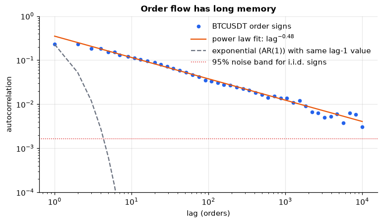
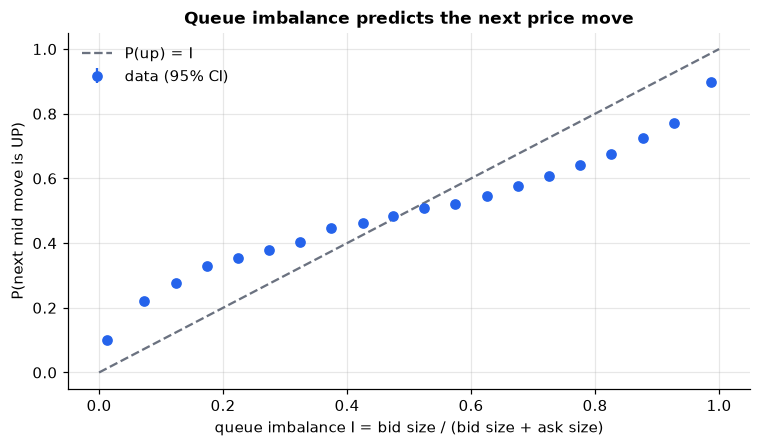
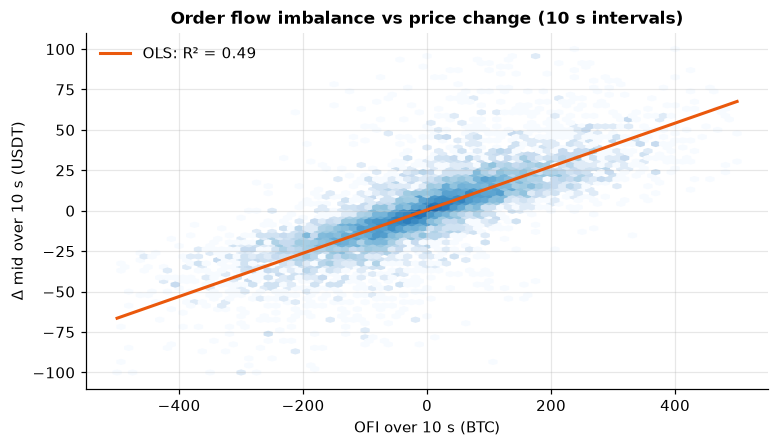
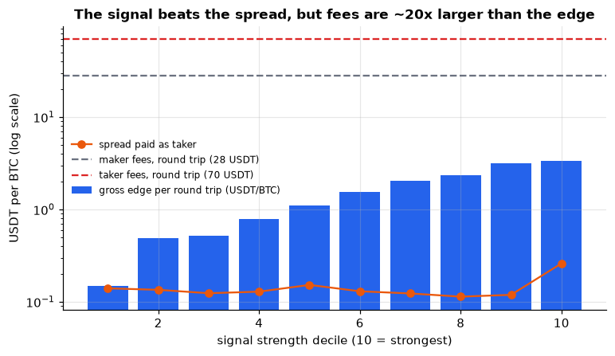

# HFT Microstructure Lab

**Empirical market microstructure on real tick data: what high-frequency traders measure, measured.**

Eleven notebook chapters take one full day of Binance BTCUSDT perpetual-futures data (15.8 million best-quote
updates, 5.5 million trades) plus a self-recorded 20-level order book, and test the classic results of the
microstructure literature against them. Every statistical tool is written out by hand in [`micro/`](micro/)
and checked against a reference implementation or a simulation with known answers in [`tests/`](tests/).

<p align="center">
  
  
  
  
</p>

## What the data shows

| # | Chapter | Question | Finding on BTCUSDT, 27 Mar 2024 |
|---|---|---|---|
| 0 | [A day in the life](notebooks/00_data_tour.ipynb) | What does tick data look like? | 183 book updates/s vs 17 orders/s. 41% of the day's volume trades in the two hours around the US equity open. |
| 1 | [Spread and tick size](notebooks/01_spread_and_tick_size.ipynb) | How wide is the spread? | Exactly 1 tick **98.7%** of the time: a large-tick asset. Spreads that open are refilled in a median **1 ms**. |
| 2 | [Trade signs and long memory](notebooks/02_trade_signs_long_memory.ipynb) | Do buys follow buys? | Sign autocorrelation decays as **lag^−0.48** (power law, not exponential). Net order flow is superdiffusive: Var ∝ N^1.52 = N^(2−γ). |
| 3 | [Noise and the signature plot](notebooks/03_noise_and_signature_plot.ipynb) | Does more data give better volatility? | Tick-by-tick realized vol says **9.7%/day**; the truth is ≈ **3.5%**. Bid–ask bounce adds ~90% noise. Mid prices bias the *other* way below 10 s. |
| 4 | [Roll and adverse selection](notebooks/04_roll_and_adverse_selection.ipynb) | Who wins a trade? | Roll's estimator says the spread is 3.4 USDT (truth: 0.1). The **realized spread turns negative within 100 ms**: on average, makers lose to takers. |
| 5 | [Order flow imbalance](notebooks/05_order_flow_imbalance.ipynb) | What moves the price? | OFI explains **41–49%** of mid-price variance (61–74% with trade flow), with impact β ∝ depth^−1.19. Predictive power is ~2% at 1 s and zero at 1 min. |
| 6 | [Queue imbalance and microprice](notebooks/06_queue_imbalance_microprice.ipynb) | What's the best fair value? | P(next move up) rises from **13% to 87%** with imbalance; **76%** directional accuracy out of sample. A data-driven microprice cuts 100 ms forecast error by 8%. |
| 7 | [Price impact](notebooks/07_price_impact.ipynb) | How much does trading move prices? | Impact is concave, ∝ size^0.3–0.6. Kyle's λ ≈ 0.3 USDT per BTC from 10 s to 15 min. Includes a square-root-law cost calculator. |
| 8 | [Hawkes clustering](notebooks/08_hawkes_clustering.ipynb) | Are arrivals Poisson? | No: the Fano factor reaches 12,000 at 10-minute windows. A Hawkes fit gives a branching ratio of **0.29** in a quiet hour and **0.76** at the US open, checked by time-rescaling QQ plots. |
| 9 | [A signal and its costs](notebooks/09_signal_and_costs.ipynb) | Is there money in it? | Out-of-sample R² 3.7% and a 69% hit rate, but the edge is **0.5 bp** against **10 bp** of taker fees. Includes latency decay and an overfitting demo. |
| 10 | [Beyond level one](notebooks/10_depth_beyond_level_one.ipynb) | Does the deeper book help? | Self-recorded 2 h of the 20-level book: a liquidity wall at the touch with crumbs behind, yet adding 20 levels of OFI lifts out-of-sample R² from **0.34 to 0.46**. Event-level OFI beats 100 ms snapshots (0.48 vs 0.34). Bonus: the PC's clock drifted 87 ms/hour. |

Each chapter ends with **interview questions** (with answers) and **exercises**.

## How to study this repo

For each chapter:

1. **Read the notebook** on GitHub top to bottom. The markdown explains the idea, and the outputs show what happened.
2. **Open the `micro/` module it imports** and read the function it calls. Each one is short and commented, with the
   formula written out (e.g. `ofi_events` in `book.py`, `ols` with Newey-West errors in `stats.py`, `loglik` in `hawkes.py`).
3. **Read the matching test.** It shows how the function is *verified*: a hand-worked example, a simulation where the
   true answer is known, or a comparison with statsmodels. That habit is the most transferable skill here.
4. **Do the "Try this yourself" exercises.** Edit `notebooks/NN_*.py` (VS Code runs `# %%` cells interactively) and rebuild.
5. **Answer the interview questions out loud** before expanding the answers.

Suggested order: 0 → 1 → 6 (imbalance needs only chapter 1) → 2 → 3 → 4 → 5 → 7 → 8 → 9 → 10.

## Running it

Requires Python 3.10+ (developed on 3.12, Windows).

```bash
python -m venv .venv
.venv/Scripts/python -m pip install -r requirements.txt   # macOS/Linux: .venv/bin/python
.venv/Scripts/python -m pip install -e .

.venv/Scripts/python -m pytest                            # 22 tests, no data needed
.venv/Scripts/python scripts/download_binance.py          # ~225 MB from data.binance.vision, checksum-verified
.venv/Scripts/python scripts/record_binance.py --minutes 120   # live depth for chapter 10
.venv/Scripts/python scripts/build_notebooks.py           # execute all chapters (~6 min)
```

The notebooks are stored twice: `notebooks/NN_*.py` is the source (plain Python in
[percent format](https://jupytext.readthedocs.io/en/latest/formats-scripts.html), easy to diff and runnable cell by
cell in VS Code) and `notebooks/NN_*.ipynb` is the executed version GitHub renders.

## Layout

```
micro/               the library: every estimator, written out with comments
  data.py            load and cache Binance files and live recordings
  book.py            mid, spread, imbalance, weighted mid, order flow imbalance (single and multi-level)
  signs.py           tick rule, quote rule, Lee-Ready
  stats.py           FFT autocorrelation, OLS with Newey-West errors, binned means, log-log fits
  volatility.py      realized variance, signature plots, noise variance, Roll estimator
  impact.py          spread decomposition, response function
  hawkes.py          Hawkes simulation (Ogata thinning), exact MLE, compensator
  lobster.py         loader for LOBSTER Nasdaq data, if you have access (see below)
notebooks/           the 11 chapters
scripts/             download, record, build
tests/               each tool vs statsmodels or a simulation with a known answer
figures/             every chart, as PNG
```

## Data

- **Historical**: [Binance public data](https://data.binance.vision), USDⓈ-M futures, BTCUSDT, 2024-03-27,
  `bookTicker` and `trades`. Binance stopped publishing `bookTicker` after March 2024, which is why this day was chosen.
- **Live**: Binance's public websocket streams (`depth20@100ms`, `bookTicker`, `aggTrade`), recorded with
  `scripts/record_binance.py`. Since 2026, order-book and trade streams live on different paths
  (`/public` and `/market`), so the recorder holds two connections.
- **LOBSTER** (Nasdaq full-depth) is supported by `micro/lobster.py` but not used in any published result. Its
  sample data now requires a request and its terms forbid publishing anything derived from it.

Raw data isn't committed (see `.gitignore`); the scripts re-create it.

## Key references

- Bouchaud, Bonart, Donier & Gould (2018), *Trades, Quotes and Prices*, Cambridge UP. The textbook for most of this.
- Cont, Kukanov & Stoikov (2014), *The price impact of order book events*, J. Financial Econometrics. (ch. 5)
- Stoikov (2018), *The micro-price: a high-frequency estimator of future prices*, Quantitative Finance. (ch. 6)
- Lillo & Farmer (2004), *The long memory of the efficient market*, Studies in Nonlinear Dynamics & Econometrics. (ch. 2)
- Lillo, Mike & Farmer (2005), *Theory for long memory in supply and demand*, Physical Review E. (ch. 2)
- Andersen, Bollerslev, Diebold & Labys (2000), *Great realizations*, Risk. (ch. 3)
- Zhang, Mykland & Aït-Sahalia (2005), *A tale of two time scales*, JASA. (ch. 3)
- Roll (1984), *A simple implicit measure of the effective bid-ask spread*, J. Finance. (ch. 4)
- Kyle (1985), *Continuous auctions and insider trading*, Econometrica. (ch. 7)
- Bouchaud, Gefen, Potters & Wyart (2004), *Fluctuations and response in financial markets*, Quantitative Finance. (ch. 7)
- Hawkes (1971), *Spectra of some self-exciting and mutually exciting point processes*, Biometrika. (ch. 8)
- Filimonov & Sornette (2012), *Quantifying reflexivity in financial markets*, Physical Review E. (ch. 8)
- Xu, Gould & Howison (2018), *Multi-level order-flow imbalance in a limit order book*, Market Microstructure and Liquidity. (ch. 10)

## Licence

Code: MIT. Market data belongs to its providers and is not redistributed here.
